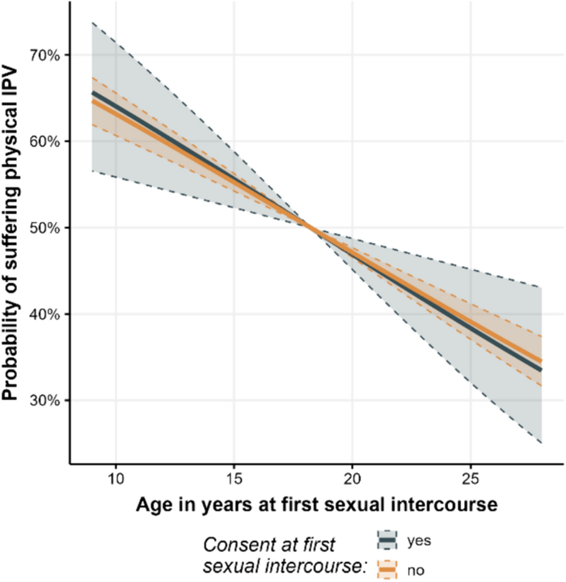
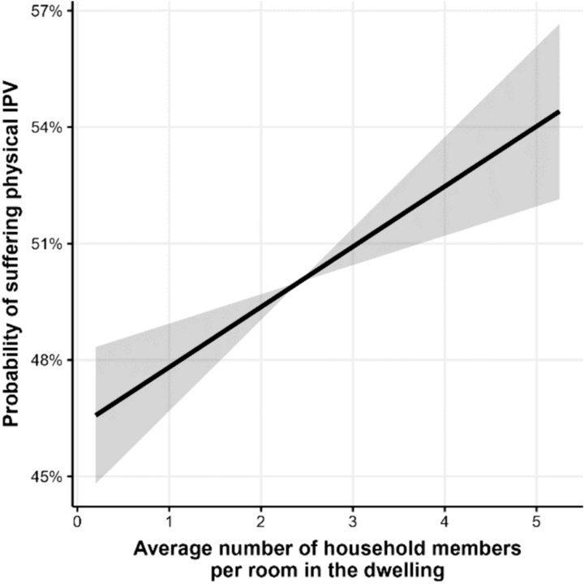
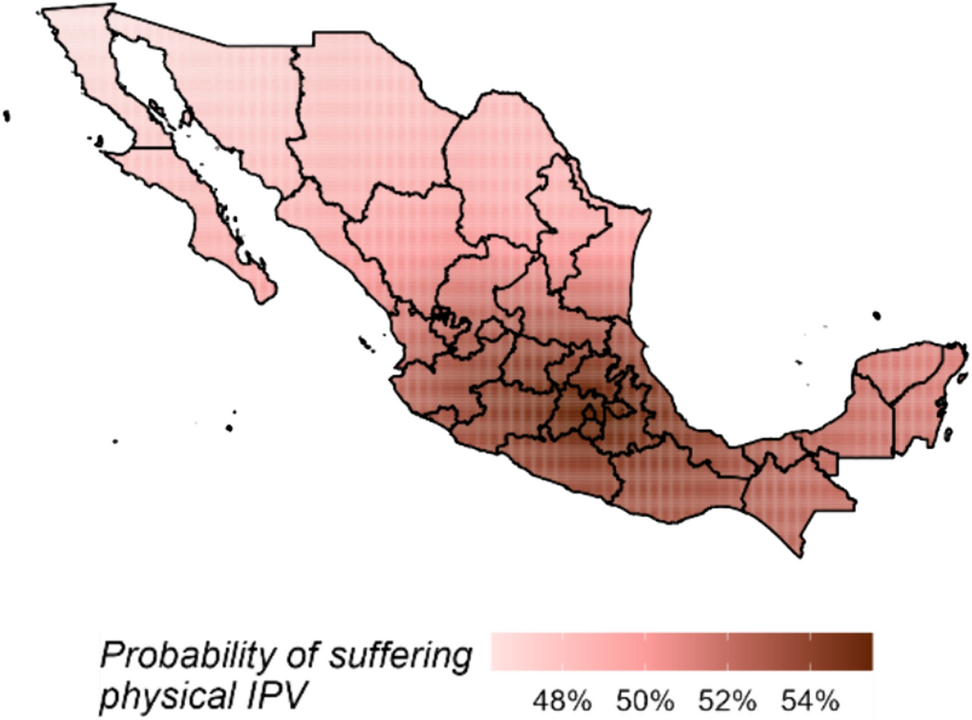

```{r}
line_1 <- "Risk factors for crime and **gender-based violence** victimization"
line_2 <- "Individual-, community-, and regional-level **correlates of poverty**"
line_3 <- "**Insights and forecasts** for **humanitarian emergencies**"
```

## RESEARCH AGENDA
The goal of my academic work is to provide scientific evidence to better understand _how **individuals**, **families**, and **communities** experience, adapt to, and cope with humanitarian- and development-related phenomena_. To address this question, I integrate **statistical methods**, **machine learning algorithms**, and **data science techniques**.

<br>

## RESEARCH AGENDA
The goal of my academic work is to provide scientific evidence to better understand _how **individuals**, **families**, and **communities** experience, adapt to, and cope with humanitarian- and development-related phenomena_. To address this question, I integrate **statistical methods**, **machine learning algorithms**, and **data science techniques**.

<br>

**Specific lines of research:**

1. `r line_1`.  
2. `r line_2` (income, food insecurity, energy poverty, etc.).  
3. `r line_3` (armed conflict, disease outbreaks, forced displacement, etc.).

## RESEARCH AGENDA
The goal of my academic work is to provide scientific evidence to better understand _how **individuals**, **families**, and **communities** experience, adapt to, and cope with humanitarian- and development-related phenomena_. To address this question, I integrate **statistical methods**, **machine learning algorithms**, and **data science techniques**.

<br>

**Specific lines of research:**

1. <span style="color:#4338CA;">`r line_1`.</span>  
2. <span style="color:#DDEEFC;">`r line_2` (income, food insecurity, energy poverty, etc.).</span>  
3. <span style="color:#DDEEFC;">`r line_3` (armed conflict, disease outbreaks, forced displacement, etc.).</span>


## 
#### `r line_1`.

<br>

**MOTIVATION:** 

According to the 2021 National Survey on the Dynamics of Household Relationships (ENDIREH), in Mexico:

- **70.1%** of women aged 15 and over have experienced at least one form of violence and/or discrimination.

- **39.9%** have experienced **intimate partner violence (IPV)**.

- Among IPV victims, **78.3%** neither sought support nor filed a complaint or report.

- Beyond physical and sexual health consequences, IPV also has **psychological consequences**: **9.6%** have considered or attempted suicide following victimization.

## 
#### `r line_1`.

<br>

**OBJECTIVE:** 

To **identify and describe** the extent to which a set of **risk factors** from the _ecological model_ are associated with **physical IPV against women and girls in Mexico**.

<br>

The _ecological model_ is a **theoretical framework** that conceptualizes violence as the result of the of the interaction of multiple factors at four interrelated levels: **individual, relationship, community, and society**.

## 
#### `r line_1`.

<br>

**DATA:**

Dataset of 35,000 observations and 42 theoretical correlates from 10 data sources was created, covering the four levels of the ecological model:

::: {.panel-tabset}

#### <span style="background-color:#40A1FF; color:black;">Individual</span>

- Caracteristics of the woman: age, income, education, age at her first sexual intercourse, etc.

- Caracteristics of the woman's partner: age, income, education, etc.

- **Source:** ENDIREH

#### <span style="background-color:#40A1FF; color:black;">Relationship</span>

- Age of the woman at marriage or at cohabitation.

- Woman's level of autonomy in the context of the relationship.

- Average number of household members per room in the dwelling.

- Division of housework among household members.

- **Source:** ENDIREH

#### <span style="background-color:#FFE099; color:black;">Community</span>

- Level of social marginalization. 

- Type of community (rural, urban).

- Share of women-headed households.

- Homicides against women.

- Migration.

- **Source:** ENIGH, Census, Homicide records, UNDP

#### <span style="background-color:#D92632; color:black;">Regional</span>

- Quality of government.

- Quality of public services.

- Perception of corruption.

- **Source:** ENCIG, ENVIPE

:::

## 
#### `r line_1`.

<br>

**DATA:**

The ecological model creates a three-dimensional hierarchical structure, linking individual- and relationship-level data to municipal- and state-level information.

::: r-hstack
::: {data-id="box1" auto-animate-delay="0" style="background: #40A1FF; width: 200px; height: 150px; margin: 10px;"}
:::

::: {data-id="box2" auto-animate-delay="0.1" style="background: #FFE099; width: 200px; height: 150px; margin: 10px;"}
:::

::: {data-id="box3" auto-animate-delay="0.2" style="background: #D92632; width: 200px; height: 150px; margin: 10px;"}
:::
:::

## 
#### `r line_1`.

<br>

**DATA:**

The ecological model creates a three-dimensional hierarchical structure, linking individual- and relationship-level data to municipal- and state-level information.

::: r-stack
::: {data-id="box3" style="background: #D92632; width: 350px; height: 350px; border-radius: 200px;"}
:::

::: {data-id="box2" style="background: #FFE099; width: 250px; height: 250px; border-radius: 200px;"}
:::

::: {data-id="box1" style="background: #40A1FF; width: 150px; height: 150px; border-radius: 200px;"}
:::
:::

## 
#### MODEL

<br>

**Binomial response variable**, indicating **whether a woman experienced physical violence within an intimate relationship in the past 12 months**.

Predictors include the variables mentioned above, considering **linear and nonlinear effects, spatial effects, interaction effects, and random effects**.

All these components are specified within a **structured additive regression (STAR) model**.

## 
#### MODEL

<br>

STAR models provide a model-based framework in which different functional forms (e.g., linear and nonlinear effects) can **compete to determine which best describes the relationship between covariates and the response variable**.

This framework allows us to consider **multiple potential effects simultaneously** and better capture the complexity of the phenomenon under study.

## 
#### MODEL
<br>

Due to its **high dimensionality and complex structure** the model cannot be estimated via traditional inference models. 

I designed a three-step strategy is used to estimate the STAR model:

::: {.panel-tabset}

#### Boosting algorithm
- It **combines estimation with simultaneous variable selection and model choice** by iteratively selecting the best-fitting effect at each step. 

- To ensure unbiased variable selection and model choice, one degree of freedom is assigned to each candidate effect (e.g. linear vs. nonlinear).

- To avoid overfitting, cross-validation is used to determine the optimal number of iterations, mitigating multicollinerity.

- The boosting algorithm yields the best predictive model, retaining only relevant predictors in their most appropriate functional form.

#### Stability selection
- To avoid selecting non-relevant variables, subsampling generates multiple random subsets, and the boosting algorithm controls the error rate while selecting predictors.

- The relative selection frequency for each effect is computed across subsets; effects exceeding a predefined threshold are retained as stable.

- The result is a parsimonious model including only stable factors (non-zero coefficients).

#### Confidence intervals
- Finally, 95% confidence intervals for the subset of effects selected as stable are calculated by drawing 1000 random samples from the empirical distribution of the data using a bootstrap approach based on pointwise quantiles.

:::

## 
#### Boosting algorithm
<br>


## 
#### Findings
<br>

**Physical IPV victimization risk and women’s age at first sexual intercourse by consent.**

:::: {.columns}

::: {.column width="50%"}

- Women who initiate sex during childhood are a particularly vulnerable population to physical IPV in Mexico.

:::

::: {.column width="50%"}

{fig-align="center" style="width:90%; max-width:none;"}

:::

::::

## 
#### Findings
<br>

**Physical IPV victimization risk and average number of household members per room in the dwelling.**

:::: {.columns}

::: {.column width="50%"}

- As the number of household members grows, the likelihood of suffering from physical violence in the context of intimate relationships increases at a rate of 1.6 percentage points per member per room in the dwelling.

:::

::: {.column width="50%"}

{fig-align="center" style="width:90%; max-width:none;"}

:::

::::

## 
#### Findings
<br>

**Spatial effects of physical IPV victimization risk.**

:::: {.columns}

::: {.column width="50%"}

- Women and girls living in municipalities located in the central region of Mexico are on average more likely to suffer from physical violence perpetrated by their partner than women living in other regions.

:::

::: {.column width="50%"}

{fig-align="center" style="width:90%; max-width:none;"}

:::

::::

##
#### Papers in this presentation:

**Research on pandemic- and epidemic-prone disease outbreaks**

- Torres Munguía JA, _et al_ (2022) _A global dataset of pandemic- and epidemic-prone disease outbreaks_. **Nature Scientific Data** 9, 683. DOI: [10.1038/s41597-022-01797-2](https://doi.org/10.1038/s41597-022-01797-2).

- Torres Munguía JA, Martínez-Zarzoso I. (2026) _Global trends of pandemic-prone and epidemic-prone disease outbreaks in 2024_. **BMJ Global Health**. DOI: [10.1136/bmjgh-2025-020708](https://doi.org/10.1136/bmjgh-2025-020708)

**A computational approach to gender-based violence**

- Torres Munguía, JA (2024) _A model-based boosting approach to risk factors for physical intimate partner violence against women and girls in Mexico_. **Journal of Computational Social Science** 7, 1937–1963 . DOI: [10.1007/s42001-024-00292-5](https://doi.org/10.1007/s42001-024-00292-5)


# THANK YOU! {background-color="#0039a6"}
<br><br>

:::: {.columns}
::: {.column width="20%"}
:::

::: {.column width="45%"}
<span style="font-size:0.90em;">To learn more about me and my work,
please scan or visit my website</span>
:::

::: {.column width="35%"}
<div style="text-align:center;">
{width="50%"}
</div>

<div style="text-align:center;">
<a href="https://juan-torresmunguia.netlify.app"
   style="font-size:0.70em; font-weight:600;">
   juan-torresmunguia.netlify.app
</a>
</div>
:::
::::
